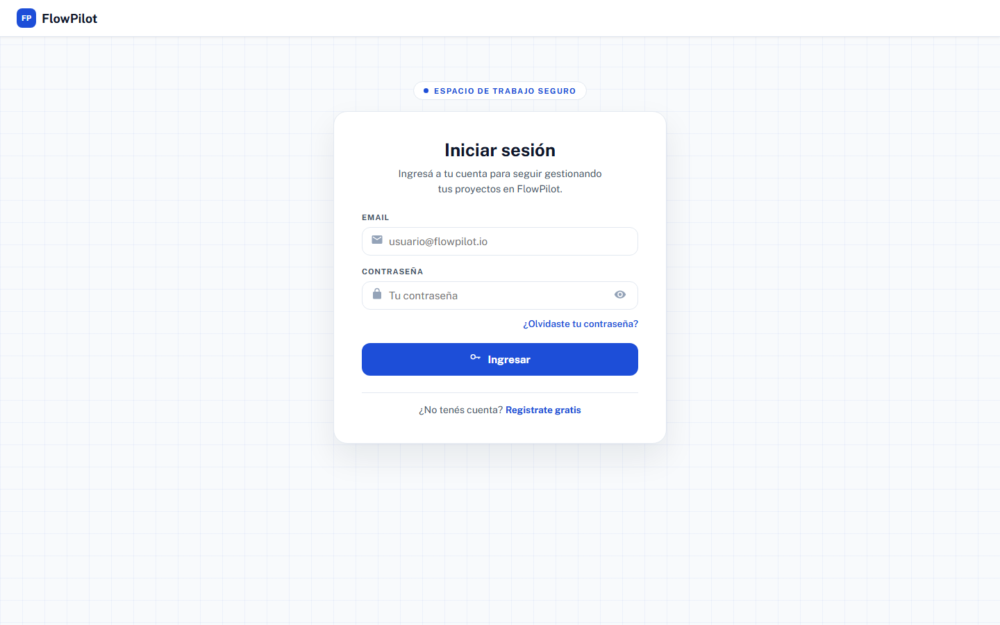
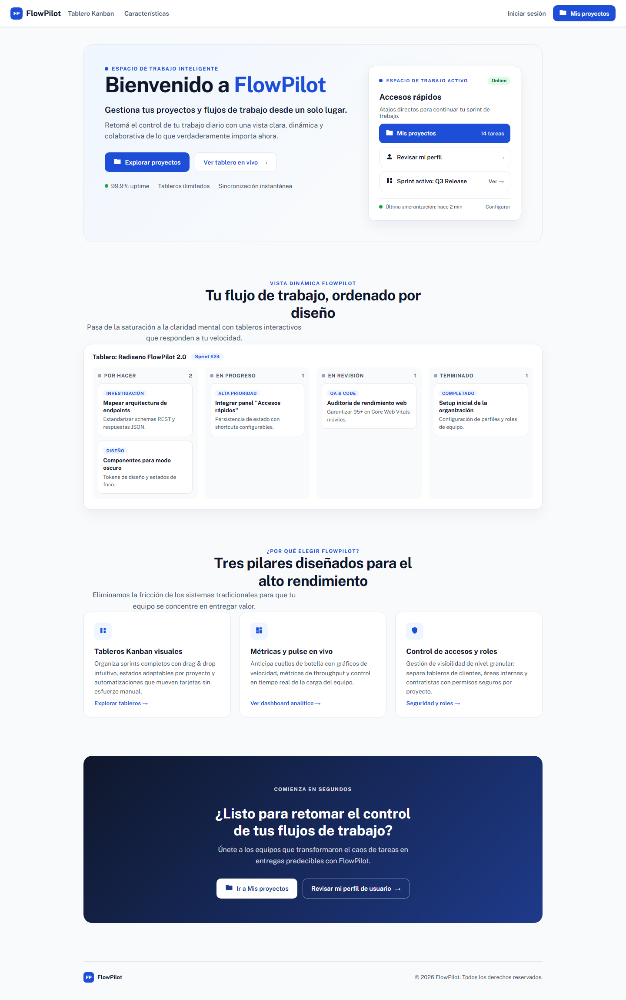
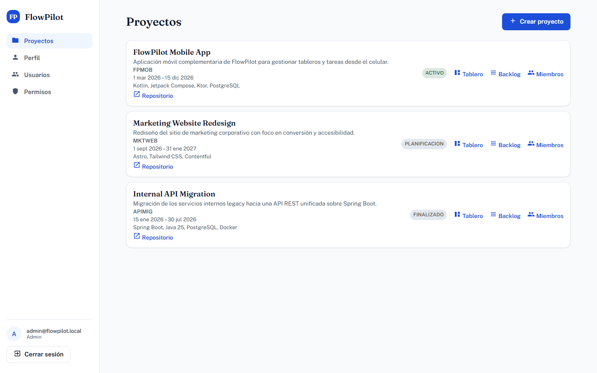
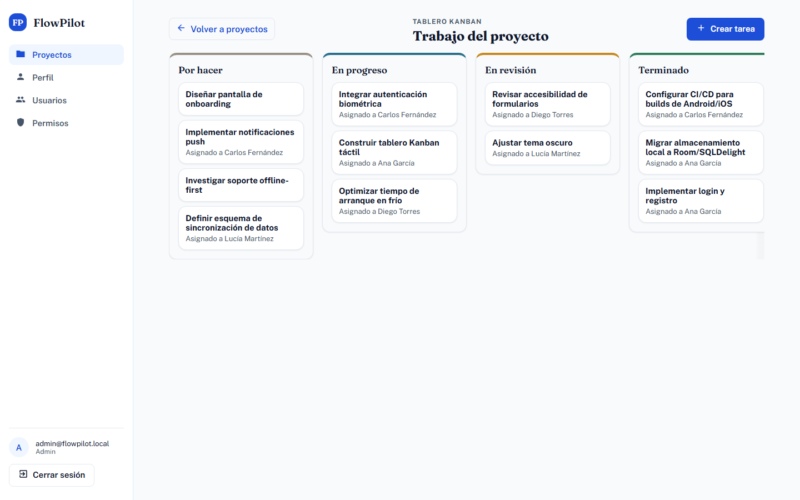
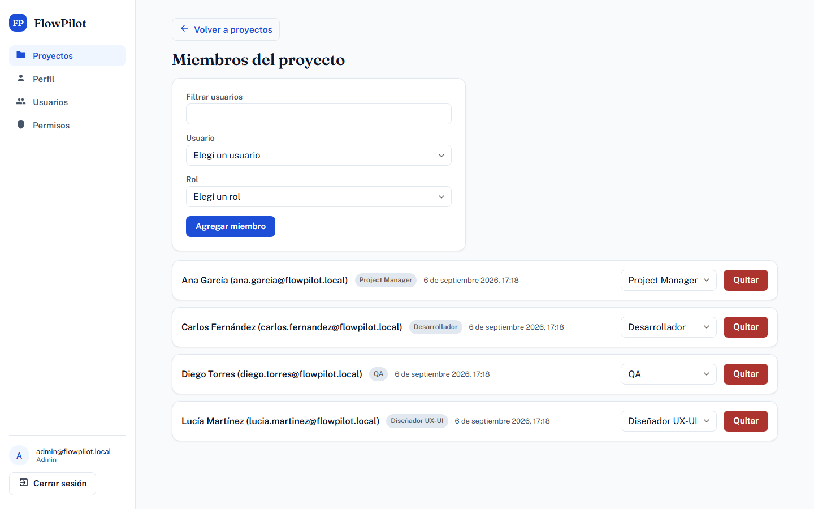
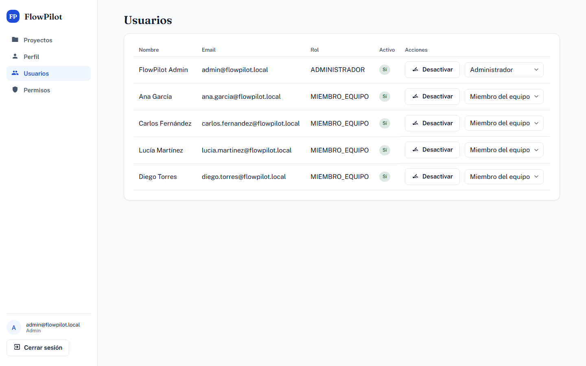
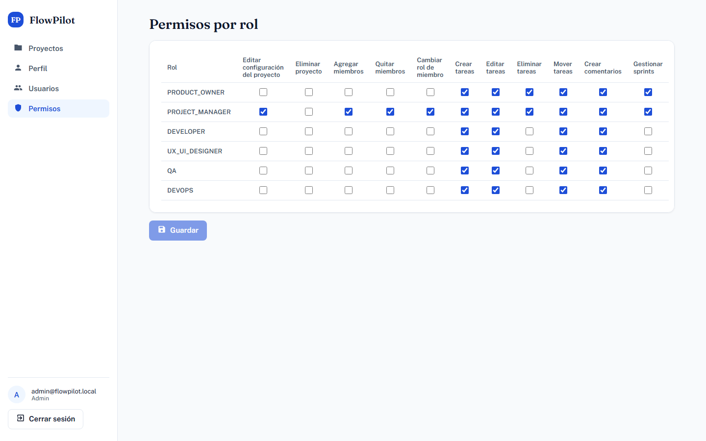
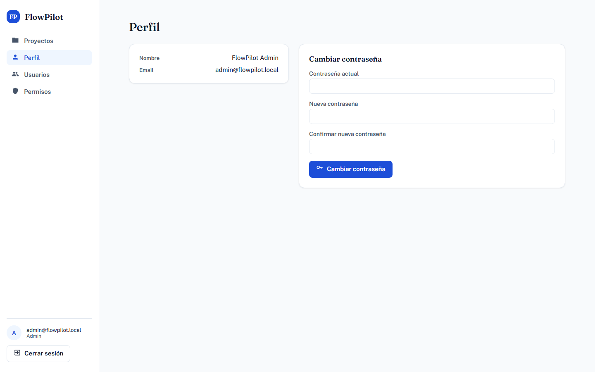
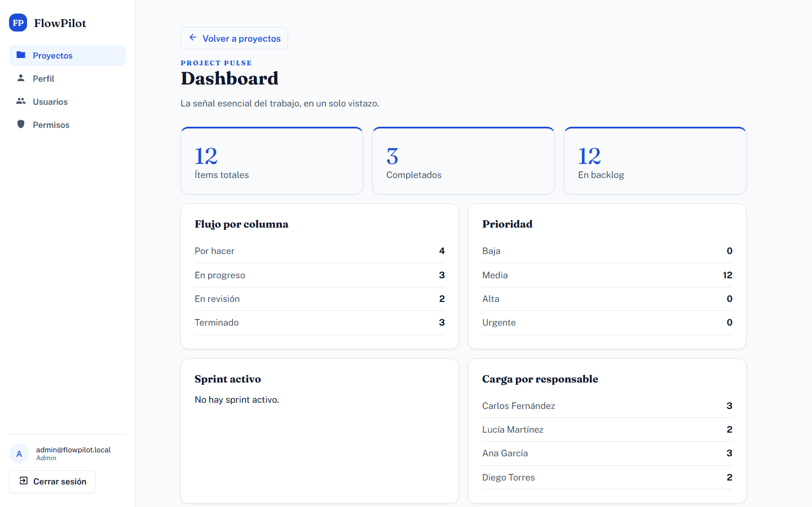
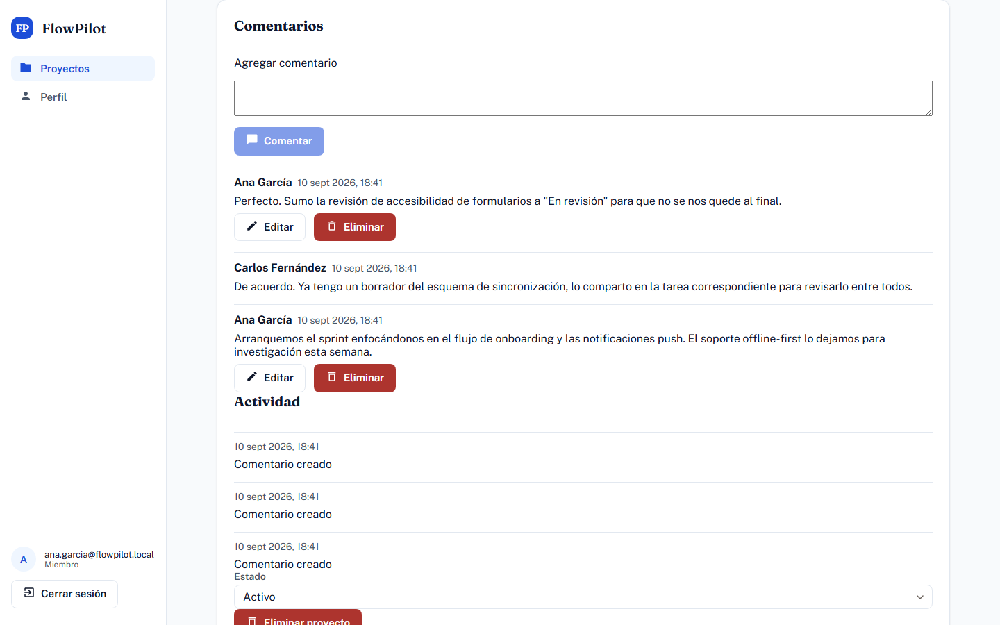

# FlowPilot

FlowPilot is an AI-assisted agile project management platform — a personal portfolio project built to demonstrate a production-shaped full-stack setup: a layered Spring Boot backend, a standalone Angular frontend, contract-first API design, and a CI pipeline that actually runs the test suites.

Full product vision: [`FlowPilot_Gestor_Proyectos_IA.md`](FlowPilot_Gestor_Proyectos_IA.md) (broader than the current MVP below).

## Screenshots

| | |
|---|---|
| **Login** | **Home** |
|  |  |
| **Projects** | **Kanban board** |
|  |  |
| **Project members** | **Admin — users** |
|  |  |
| **Admin — role/permission matrix** | **Profile** |
|  |  |
| **Project dashboard** | **Comments & activity feed** |
|  |  |

## What's implemented

- **Auth & session**: register, login, refresh-token rotation with reuse detection, logout, forgot-password, reset-password — backed by short-lived JWT access tokens plus an `HttpOnly` refresh cookie, and a double-submit CSRF filter protecting the refresh/logout endpoints.
- **User directory & admin**: authenticated user listing, admin-only user management (activate/deactivate, global role changes, last-active-admin guard).
- **Projects**: full CRUD with rich fields (code, dates, technologies, repository URL), status transitions, and per-project default Kanban columns.
- **Project members**: add/remove/change role, including a confirmed self-removal flow.
- **Kanban board**: work-item CRUD, drag-and-drop move between and within columns.
- **Backlog and sprints**: project backlog browsing and sprint planning with work-item assignment.
- **Role-permission matrix**: a dense, project-role × permission grid, editable by admins with optimistic-concurrency protection.
- **Profile**: view your own name/email and change your password, which revokes your other active sessions.
- **Project dashboard**: per-project metrics — item totals, completion and backlog counts, per-column flow, priority distribution, active sprint progress, and per-assignee workload.
- **Comments & activity feed**: threaded comments on projects and individual work items (create/read/update), plus an authorization-checked project activity feed surfacing membership, status, sprint, and comment events.
- **AI user-story generation** (vision-doc slice 7.1): turn a free-text requirement into a draft user story (`Como … quiero … para …`) plus acceptance criteria, which you edit and confirm before it becomes a work item. **Off by default** — with the flag off, a deterministic stub keeps the endpoint and screen answering; with it on, generation runs against a local [Ollama](https://ollama.com) model. Nothing is persisted until you confirm. See ["Turning on AI generation"](#turning-on-ai-generation) below.
- **AI subtask generation** (vision-doc slice 7.3): from an existing story or free text, the assistant proposes up to 10 technical subtasks (`/projects/:id/ai/subtasks`, reachable from the project detail row and the board work-item panel). You edit the drafts, pick a target board column and optional sprint, and confirm — a single transactional batch create turns them into linked child work items and navigates back to the board. Shares the same **off-by-default** flag and stub/Ollama seam; nothing is persisted until you confirm.
- **AI acceptance-criteria generation** (vision-doc slice 7.2): the board work-item detail panel now shows and lets you edit a work item's acceptance criteria (ordered list, add/edit/remove, capped at 8) — this works with the flag off. With it on, "Generar criterios con IA" (`POST /api/projects/:id/ai/acceptance-criteria`, guarded by `WORKITEM_EDIT`) proposes 1–8 criteria and seeds an **append-only union draft**: your existing criteria first, the suggestions appended, all editable. Accepting merges the draft into the edit form; discarding leaves your saved criteria untouched. Nothing persists until you save the panel (the existing work-item `PUT`).
- **Spanish-localized errors**: auth, projects, members, board, admin, and profile error/validation messages are translated end-to-end (see [`CLAUDE.md`](CLAUDE.md) for the few remaining English-only paths).
- **API contract**: [`api/openapi.yaml`](api/openapi.yaml) is hand-authored and contract-first, with a CI job that diffs it against the live-generated spec for breaking changes.

See [`CLAUDE.md`](CLAUDE.md) for the full current-status breakdown and what remains toward a complete MVP (the rest of the vision-doc 7.x AI features, comment deletion, etc.).

## Tech stack

- **Backend**: Spring Boot 4, Java 25, Spring Security, jjwt, Flyway, PostgreSQL
- **Frontend**: Angular 21 (standalone components), Vitest for unit tests, Playwright for e2e
- **Infra**: Docker Compose (Postgres + backend + nginx-served frontend), GitHub Actions CI (backend tests, frontend tests + build, e2e)

## Running it locally

Requires Docker and Docker Compose.

```bash
# Create the ignored local environment file and replace every placeholder with local values.
cp .env.example .env
$EDITOR .env
docker compose up --build
```

- Frontend: http://localhost
- Backend API (proxied under `/api` by the frontend, or directly): http://localhost:8080
- Postgres: `localhost:5432`

For production deployment, configuration, backups, rollback, and operational checks, see [`docs/DEPLOYMENT.md`](docs/DEPLOYMENT.md). The Compose instructions above remain the local quick start.

On first boot, Flyway seeds the database with demo data so the app isn't empty:

| Email | Password | Role |
|---|---|---|
| `admin@flowpilot.local` | `ChangeMe123!` | Administrador |
| `ana.garcia@flowpilot.local` | `Demo1234!` | Miembro del equipo |
| `carlos.fernandez@flowpilot.local` | `Demo1234!` | Miembro del equipo |
| `lucia.martinez@flowpilot.local` | `Demo1234!` | Miembro del equipo |
| `diego.torres@flowpilot.local` | `Demo1234!` | Miembro del equipo |

These are local/dev-only bootstrap credentials — rotate them before any real deployment.

### Turning on AI generation

AI user-story generation is opt-in. The default `docker compose up --build` runs with `flowpilot.ai.enabled=false` and a deterministic stub generator, so the endpoint and the `/projects/:id/ai/user-stories` screen work without any model — the stub just returns a canned draft.

To generate against a real local model, add the `docker-compose.ai.yml` override (it starts an [Ollama](https://ollama.com) container, points the backend at it, and flips the flag on) and pick a model:

```bash
# FLOWPILOT_AI_OLLAMA_MODEL is mandatory with the override — compose aborts without it.
FLOWPILOT_AI_OLLAMA_MODEL=llama3 docker compose -f docker-compose.yml -f docker-compose.ai.yml up --build

# One-time: pull the model into the Ollama volume.
docker compose -f docker-compose.yml -f docker-compose.ai.yml exec ollama ollama pull llama3
```

The backend calls Ollama's OpenAI-compatible `/v1/chat/completions` with a 5s connect / 60s read timeout and no retry; if the model is unreachable, slow, or returns unusable output you get a Spanish RFC 7807 **503** rather than a partial result. Setting `FLOWPILOT_AI_ENABLED=false` (or just dropping the override) instantly restores the stub with no rebuild. AI provenance recorded on a confirmed work item (`aiGenerated` / `aiModel`) is what the client claims, not something the server verifies.

### Running the backend or frontend on their own

Backend (from `backend/`):

```bash
./mvnw spring-boot:run   # requires JAVA_HOME pointed at a JDK 25
./mvnw -B test           # full test suite
```

Frontend (from `frontend/`):

```bash
npm ci
ng serve   # dev server
ng test --watch=false   # unit tests
ng build   # production build
```

### Backend test troubleshooting

From `backend/`, the normal full-suite command is:

```bash
./mvnw -B test
```

The integration tests use Testcontainers 1.21.2 and require a running Docker daemon (Docker Desktop is supported). If Testcontainers cannot discover Docker on a Windows developer machine, configure the local machine rather than the repository: `~/.testcontainers.properties` may define `docker.host`, and `~/.docker-java.properties` may define `api.version`. Add these files only when discovery fails; do not commit machine-specific named-pipe or API-version settings. Without Docker, run the non-container tests with the project-specific exclusions documented in `CLAUDE.md`.

## Repository layout

| Path | Purpose |
|---|---|
| `backend/` | Spring Boot 4 layered monolith, Maven, Flyway migrations, Testcontainers-backed integration coverage. |
| `frontend/` | Angular 21 standalone-components app with auth, admin, projects, members, board, dashboard, and comments/activity slices. |
| `api/openapi.yaml` | Hand-authored OpenAPI contract for implemented API path families. |
| `docker-compose.yml` | Local stack: PostgreSQL, backend, frontend/nginx. |
| `.github/workflows/ci.yml` | CI for backend tests, frontend tests/build, and e2e. |
| `docs/screenshots/` | Screenshots used in this README. |
| `FlowPilot_Gestor_Proyectos_IA.md` | Full Spanish product vision; broader than the current MVP. |

## Architecture notes

- **Layered backend**, not hexagonal: `config`, `controller`, `dto`, `entity`, `exception`, `mapper`, `repository`, `security`, `service`.
- **Auth flow**: `AuthenticationManager`-based login issues a 15-minute stateless JWT (body) plus a 7-day opaque, DB-backed refresh token (`HttpOnly` cookie). Refresh-token rotation detects reuse and revokes all of a user's active tokens if it happens. All errors funnel through a global `@RestControllerAdvice` as RFC 7807 `ProblemDetail` responses.
- **Authorization**: project role permissions are enforced through `ProjectAuthorizationService` against a dense role/permission matrix; admin screens use separate admin-only endpoints for global user and permission-matrix management.
- **Migrations**: `backend/src/main/resources/db/migration/` — see `CLAUDE.md` for the migration-by-migration breakdown.

For the deeper contributor-facing guide (commands, config profiles, delivery model), see [`CLAUDE.md`](CLAUDE.md).
